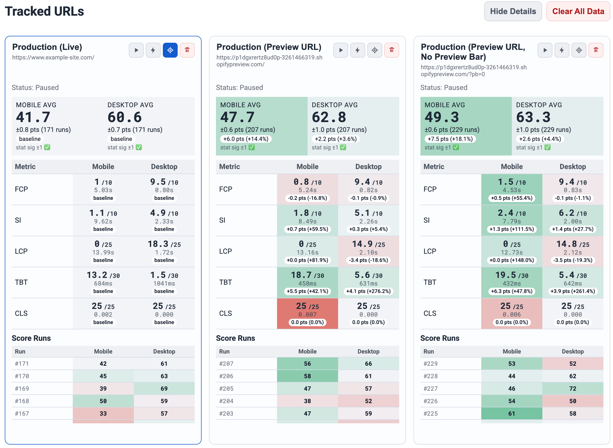

# PageSpeeder – Google PageSpeed Tracker

Track Google PageSpeed Insights performance scores repeatedly to average results over time and easily compare multiple URLs side by side with 95% confidence intervals.

## What It Does

- Runs PageSpeed Insights continuously for each tracked URL.
- Select one URL as baseline to easily compare scores.
- Runs both **mobile** and **desktop** each cycle.
- Uses a fixed **60-second poll interval** (Google PSI minimum).
- Tracks:
  - Performance score
  - FCP, SI, LCP, TBT, CLS
- Computes 95% confidence intervals (`mean ± points`) for score stability.
- Stores app state in your browser's localStorage (API key, tracked URLs, run history, etc.).
- Provides card view + comparison table with sortable columns and color-coded values.

## Screenshot


## Quick Start (Local)

### 1) Clone and enter the project

```bash
git clone git@github.com:nordrr/pagespeeder.git
cd pagespeeder
```

### 2) Install dependencies

```bash
npm install
```

### 3) Start the Vite dev server

```bash
npm run dev
```

### 4) Open the app

Go to [http://localhost:3000](http://localhost:3000).

### 5) Add your API key and first URL

1. Click **API Key** in the header.
2. Paste your Google API key and click **Save Key**.
3. Add a URL in the launch panel.

API key setup docs:
- [PageSpeed Insights API v5: Get Started](https://developers.google.com/speed/docs/insights/v5/get-started)

## Build for Production

```bash
npm run build
```

Vite will output the production files to `dist/`.

To preview the built app locally:

```bash
npm run preview
```

## Usage Notes

- All settings and collected samples are stored in your browser's localStorage.
- Polling is fixed at once every 60 seconds (otherwise, Google returns a cached result).
- Once a URL reaches stat-sig threshold (95% confidence of ±1 points), it will auto-pause.
- Clicking **Run once** on a paused card submits one cycle only.
- Clicking **Resume** enables continuous polling again.

## PageSpeed API Endpoint

The app calls:
- `https://www.googleapis.com/pagespeedonline/v5/runPagespeed`

Request parameters:
- `url`
- `key`
- `strategy` (`mobile` or `desktop`)
- `category=performance`

## Deployment

This is a static frontend bundled by Vite. You can deploy the generated `dist/` directory to any static host.
